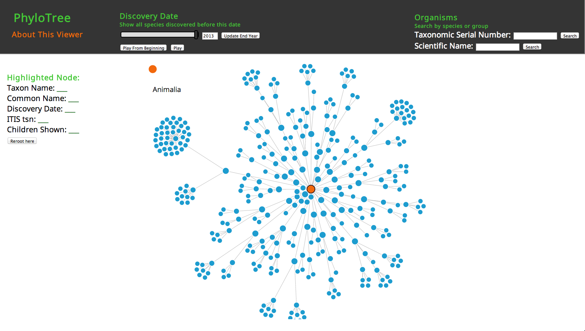
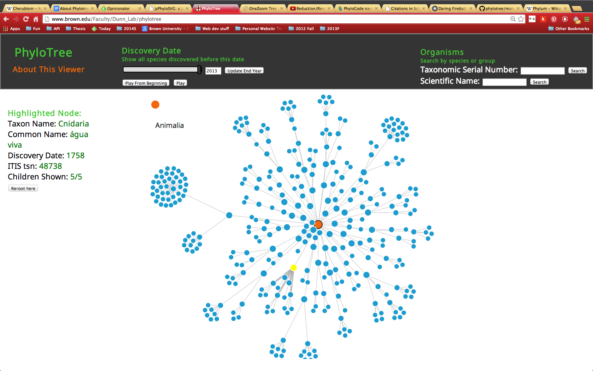

# Dynamic interaction with phylogenetic trees

## Viewing large phylogenies

### Tree Structure

Phylogeny and taxonomy data have similar structure. Phylogeny attempts to trace divergent evolutionary paths in species, while taxonomy hierarchically groups organisms based on shared characteristics, which roughly mirrors evolutionary similarities. Nested sets can be represented as an unordered tree data structure, with the outermost set representing the root of the tree, and the innermost corresponding to the leaves, or childless nodes of the tree. Phylotree is currently a tool for visualizing taxonomy within the animal kingdom. The root is the Animal kingdom itself, and successive descendants represent finer levels of stratification according to the taxonomic hierarchy, from most to least inclusive; the direct children of the root node are the animal phyla, and the leaves are individual species.

### Data reduction
There are 367717 usable entries in the ITIS database from the Animal kingdom. We wanted all of this information available for the user to access at once. At the same time, such a large number of nodes is difficult to access and interact with. In addition, rendering these data as interactive nodes overburdens the browser. Our goal was to allow people to explore this large number of species in an intuitive way. The user should be able to easily navigate to neighboring regions in the tree, as well as jump quickly to a region of interest potentially far away on the tree. 

The solution was to render subtrees with a size of no more than a few hundred nodes, and a re-rooting system to easily examine related subtrees and quickly move up or down any hierarchy. When the page first loads, the subtree including the root node (Animalia) and its "closest" 350 descendants are rendered (or fewer, depending on the size of the display). Specifically, if every node in the tree is ranked by depth (with the root node having a depth of 0, its descendendents having depth 1, and so on), the 350 lowest-depth nodes are chosen to be rendered. Ties are broken arbitrarily. This has the effect of a "well-rounded" tree, where the maximum depth is fairly uniform in all branches of the tree.

The leaves in this truncated tree may have children that are not rendered: to move "down" the tree to see these children, any node on the screen can be selected. If the "Reroot here" button is clicked, the selected node becomes the new root of the tree, and the subtree rooted at this node, again with a maximum of 350 nodes, is rendered, and nodes "above" the new root hierarchically are no longer shown as part of the tree. 

In addition, the ancestor nodes of the current root are shown as "breadcrumbs" across the top of the display area for the user to move back up the tree.

### Interactivity

PhyloTree provides three ways to interact with the Tree of Life.

#### The Tree
Every node represents a species (eg, Homo sapiens) or species group (eg, Mammalia). When an individual node is clicked, it is highlighted in yellow.Information about the node is shown in the "Highlighted Node" section. As described above, clicking "Reroot here" changes the root of the tree to the currently selected node. 

#### The year of species description
Moving the "Discovery Date" slider allows the user to see the history of species description. Only the species that were described prior to the date indicated by the slider are shown. Nodes become red as they are about to appear or disappear.

Clicking on "Play from Beginning" shows each node entering the display in order, from the first described until the present day.

#### Organism Name and Taxonomic Serial Number
These text boxes can be used to search for a particular species or group of species. Currently Phylotree supports searching by scientific nam or taxonomic serial numbers (TSN). Refer to ITIS for more information on these names, or to look up TSN.

#### Data
The taxonomic data used for Phylotree is from the Integrated Taxonomic Information System, or [itis]. ITIS is the result of a partnership of fedral agencies and other partners which provides a scientifically credible source of taxonomic information. ITIS includes the author and date, taxonomic rank, common names, a unique taxonomic serial number, data source information and data quality indicators for each scientific name in its databse. The entire database can be downloaded directly from the ITIS website as a bundle of MySQL dump files.

## Existing tools

jsPhyloSVG [@Smits:2010jl].

## Implementation of a new tool
The following is a description of how we built the first version of Phylotree, which can be referenced for other groups building visualization tools or other applications with similar features.

### Backend Implementation

#### Platforms
*Database (MySQL) - * An important design decision was our choice of our database. [mysql] is an extremely popular open-source relational database management system (RDBMS). As such, it is extremely reliable and well-supported by online open-source communities. Perhaps the most important reason to choose MySQL was that ITIS stores and exports data in a MySQL format. MySQL is easy to use, and a myriad of interfaces have been implemented for connections to other platforms (we used [anydb] to connect it to our Node.js backend). However, future implementations might consider other open-source options.

Relational database management systems such as MySQL model data in a flat tabular model, which is ideal for individual records but which is not as well suited to hierarchical or nested data as newer NoSQL databases, which have been widely adopted for web applications where hierarchical data is common (for example, nested comment threades). The tradeoff is the relatively experimental nature of existing NoSQL solutions, as well as weaker reliability guarantees since most NoSQL stores lack true [acid] transactions. 

*Node.js, express - * [node] is a server-side platform initially released in 2009. Node.js applications are written in JavaScript and maximizes efficiency using non-blocking IO and asynchronous events. Using the [express] framework allowed us to quickly set up and start the application.

*Socket.io - * [sockietio] allowed us to use WebSocket for sending data between browser and server. WebSocket is a protocol that allows the client and server to maintain a connection, passing messages back and forth, potentially in realtime. We used sockets to send new trees to the browser after searching or re-rooting operations. Sockets were also used to send and display information about individual nodes when they were clicked. Using sockets allowed a larger degree of interactivity between browser and server. The page did not have to be re-loaded after every update; rather, the necessary data was sent over the socket connection and the relevant part of the viewer (tree or displayed information) was updated.

*AWS - * For hosting, we used [ec2], an easily scalable cloud computing service. EC2 is an affordable and flexible solution for web applications. The operating system and other configurations of the instance are easily configured. EC2 allows paying only for the computing capacity used. A "Small" EC2 was sufficient for all of our memory and CPU needs.

#### Pre-processing
*ITIS tables - * In the first version of Phylotree, we used data from the following tables from the ITIS database:
_taxonomic\_units:_ This table contains information about names for each taxon, and hierarchical information. Of the various fields in this table, we use information from the following fields:
- tsn, the unique Taxonomic Serial Number of the taxon in the databse.
- unit\_name1, the unique scientific name for the taxon.
- name\_usage, the optional common name for the taxon.
- parent\_tsn, the tsn of the taxon hierarchically above this one.
- taxon\_author\_id, the optional id identifying the author of the publication first documenting the taxon. This serves as the linked to the stripped_author table
- kingdom\_id, the unique numeric id of the kingdom this taxon belongs to

_strippedauthor:_ This table contains information about the name of the authors of publications describing taxa. It links to the _taxonomic\_units_ table through the taxon\_author\_id field. The shortauthor field optionally contains a date, which we extracted as the description date of species. The "description date" of higher taxa are the same as the discovery date of the earliest described species of that taxa.

*node pre-ordering - * The hierarchical structure of the data is caputred through the atomic parent\_tsn field of the taxonomic\_units table. As such, to fetch an entire subtree containing _n_ nodes would involve _n_ SELECT requests to the database, which with large numbers of nodes is not ideal, and we wanted to minimize the number of dtabse queries. 

Our solution was to use [preorder] and preprocess the nodes to store more helpful hierarchical information than merely the parent pointer. Essentially, we performed a preorder traversal of the tree and stored the tsn of the precursor and successor of each node in this traversal as left ('lft') and right ('rgt') for each node. As such, each node's 'lft' and 'rgt' fields are the tsn of either parent or sibling nodes in the tree. Indexing and sorting by 'lft' turns the retrieval of the hierarchy into a single range query, a constant time database operation.

Phylotree as essentially a read-only app was well suited to this method, since updates to the data need not be in realtime, and the preprocessing can be done intermittently, and the 'lft' and 'rgt' pointers can be updated infrequently. This is fortunate, as the entire preprocessing operation can be time-consuming.

*Hierarchy table - * The information about each taxon, as well as pre-processing information, was stored in an auxiliary MySQL table called phylotree_hierarchy. It is from this table that Phylotree retrieved data. 

*Performance - * The preprocessing step essentially reduced all queries to a single range query to MySQL, which is sufficiently fast on a standard internet connection. 

### Frontend Implementation

#### Platforms
*D3.js - * D3.js is a Javascript library that facilitates data-driven manipulation of Document Object Model (DOM) objects. We use D3 to create the visible representation of the the tree that the user sees and interacts with in the browser. 

When a user views a tree, the nodes and links of that tree are passed into the frontend as a JSON array, and each node and link has particular attributes. We use D3 to bind a Scalable Vector Graphic (SVG) circle to each node in the array and an SVG line to each link in the array. These SVG circles and lines make up the “leaves” and “branches” of the tree that the user views, respectively. 

Further, D3 allows us to manipulate these SVG elements based on the attributes of the nodes or links they are bound to. For example, when a user selects a new date range, we use D3.js to fade out leaves of the tree bound to nodes with discovery dates outside of the new range. 

*D3 Force Layout - * Force is a D3 layout used to create an interactive force-directed graph. Force models the force-directed graph as a physical simulation of charged particles. We use Force to structure and animate the tree the user is viewing. Each node of the tree is assigned a charge, which spreads out groups of nodes and prevents individual nodes from overlapping when the tree stabilizes. Additionally, Force tracks and changes (based on the physical simulation) the position of each node and link of the tree. This functionality is responsible for the animations when a user drags a node or reroots the tree. 

*jQuery, jQuery UI - * jQuery is javascript library that streamlines HTML scripting. We use it to update the attributes of HTML elements and for event handling. For example, we use it to update the informational labels when a user selects a node, and we also it when a user drags the end year slider. 

#### Browser Restriction

Animating a tree can put a strain on browser resources, especially when the tree gets larger. Phylotree is designed to be compatible with Chrome, Firefox and Safari, but we’ve noticed that performance is best in recent versions of Chrome. 

## References
[inorder]: http://example.com "inorder"
[itis]: http://example.com "ITIS"
[mysql]: http://www.mysql.com/ "MySQL"
[acid]: http://en.wikipedia.org/wiki/ACID "ACID"
[anydb]: https://github.com/grncdr/node-any-db "Any-DB"
[node]: http://nodejs.org/ "Node.js"
[express]: http://expressjs.com/ "Express"
[socketio]: http://socket.io/ "Socket.IO"
[ec2]: https://aws.amazon.com/ec2/ "Amazon Elastic Compute Cloud (EC2)"
[preorder]: http://www.sitepoint.com/hierarchical-data-database-2/ "Modified Preorder Tree Traversal"
[D3.js]: http://d3js.org/ "D3 Data-Driven Documents"
[force]: https://github.com/mbostock/d3/wiki/Force-Layout "Force Layout"
[forcedirectedgraph]: http://en.wikipedia.org/wiki/Force-directed_graph_drawing "Force directed graph drawing"
[jquery]: http://jquery.com/ "jQuery"
