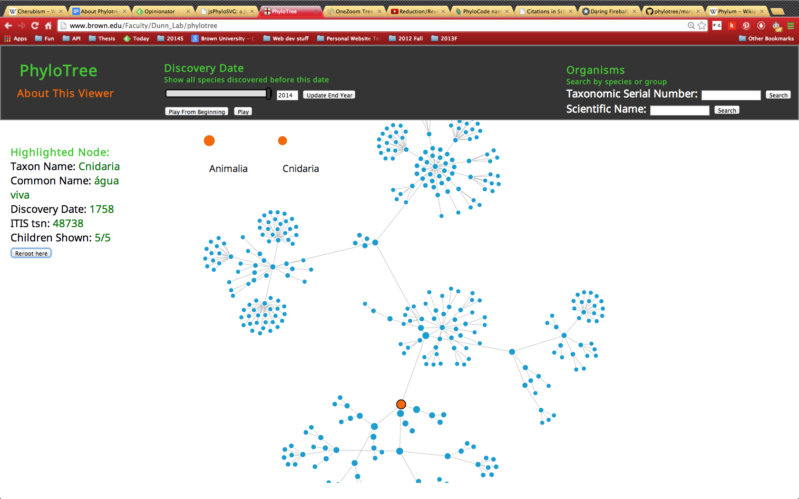

# Dynamic interaction with phylogenetic trees

## Viewing large phylogenies

### Tree Structure

Phylogeny and taxonomy data have similar structure. Phylogeny attempts to trace divergent evolutionary paths in species, while taxonomy hierarchically groups organisms based on shared characteristics, which roughly mirrors evolutionary similarities. Nested sets can be represented as an unordered tree data structure, with the outermost set representing the root of the tree, and the innermost corresponding to the leaves, or childless nodes of the tree. Phylotree is currently a tool for visualizing taxonomy within the animal kingdom. The root is the Animal kingdom itself, and successive descendants represent finer levels of stratification according to the taxonomic hierarchy, from most to least inclusive; the direct children of the root node are the animal phyla, and the leaves are individual species.

### Data reduction
There are 367717 usable entries in the ITIS database from the Animal kingdom. We wanted all of this information available for the user to access at once. At the same time, such a large number of nodes is difficult to access and interact with. In addition, rendering these data as interactive nodes overburdens the browser. Our goal was to allow people to explore this large number of species in an intuitive way. The user should be able to easily navigate to neighboring regions in the tree, as well as jump quickly to a region of interest potentially far away on the tree. 

The solution was to render subtrees with a size of no more than a few hundred nodes, and a re-rooting system to easily examine related subtrees and quickly move up or down any hierarchy. When the page first loads, the subtree including the root node (Animalia) and its "closest" 350 descendants are rendered (or fewer, depending on the size of the display). Specifically, if every node in the tree is ranked by depth (with the root node having a depth of 0, its descendendents having depth 1, and so on), the 350 lowest-depth nodes are chosen to be rendered. Ties are broken arbitrarily. This has the effect of a "well-rounded" tree, where the maximum depth is fairly uniform in all branches of the tree.

The leaves in this truncated tree may have children that are not rendered: to move "down" the tree to see these children, any node on the screen can be selected. If the "Reroot here" button is clicked, the selected node becomes the new root of the tree, and the subtree rooted at this node, again with a maximum of 350 nodes, is rendered, and nodes "above" the new root hierarchically are no longer shown as part of the tree. 

In addition, the ancestor nodes of the current root are shown as "breadcrumbs" across the top of the display area for the user to move back up the tree.

### Interactivity

PhyloTree provides three ways to interact with the Tree of Life.

#### The Tree
Every node represents a species (eg, Homo sapiens) or species group (eg, Mammalia). When an individual node is clicked, it is highlighted in yellow.Information about the node is shown in the "Highlighted Node" section. As described above, clicking "Reroot here" changes the root of the tree to the currently selected node. 

#### The year of species description
Moving the "Discovery Date" slider allows the user to see the history of species description. Only the species that were described prior to the date indicated by the slider are shown. Nodes become red as they are about to appear or disappear.

Clicking on "Play from Beginning" shows each node entering the display in order, from the first described until the present day.

#### Organism Name and Taxonomic Serial Number
These text boxes can be used to search for a particular species or group of species. Currently Phylotree supports searching by scientific nam or taxonomic serial numbers (TSN). Refer to ITIS for more information on these names, or to look up TSN.

## Existing tools
TODO

## Implementation of a new tool

### Platforms
### Backend Implementation
- RESTful API + sockets
- node pre-ordering [inorder]

#### Platforms
#### Considerations

- Performance
- In-Memory

### Frontend Implementation

#### Platforms
#### Browser Restriction

## References
[inorder]: http://example.com "inorder"

